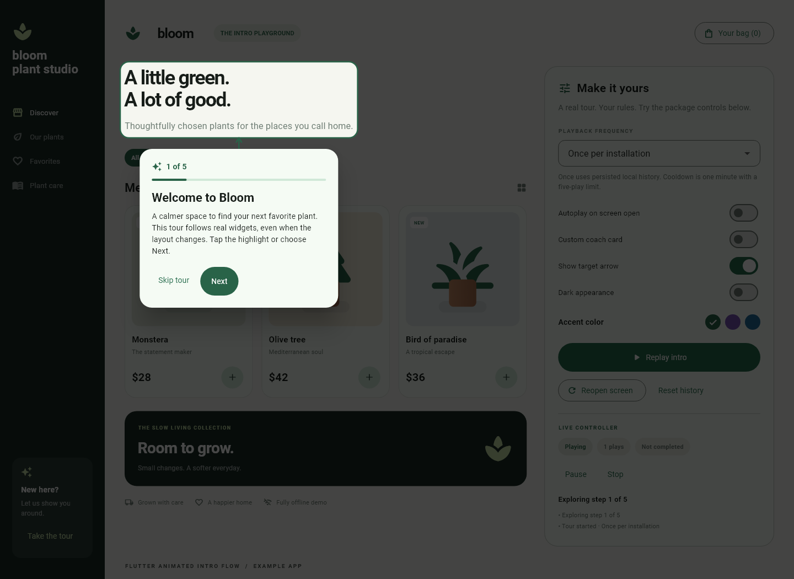

# flutter_animated_intro_flow

Animated walkthroughs that highlight real Flutter widgets and perform real actions.
Wrap a screen, describe its steps, and let the intro play when the screen opens.
Use any state manager, localization system, or local storage. The package depends
only on Flutter and performs no network requests.



## Features

- Three target APIs: wrap a widget, use an existing `GlobalKey`, or supply a widget.
- Autoplay on screen opening, optional delay, and an explicit manual mode.
- Once, once per session, every visit, cooldown, and maximum automatic play count.
- Pluggable local history, versioned tour IDs, replay, and reset.
- Async actions with explicit advance/stay results; async step preparation.
- Animated spotlights, arrows, clipped scroll targets, and automatic scrolling.
- Navigator-level overlays that follow targets into dialogs and bottom sheets.
- Back, next, jump, pause, resume, retry, skip, stop, and completion controls.
- Theme, translated button labels, custom card builder, per-step placement and shape.
- Input locking, background focus/semantics exclusion, reduced-motion support,
  scrollable coach cards, and application/route lifecycle handling.

## Install

Add the package to your Flutter app:

```sh
flutter pub add flutter_animated_intro_flow
```

Or add the dependency to `pubspec.yaml`:

```yaml
dependencies:
  flutter_animated_intro_flow: ^0.1.0
```

For local development, use a path dependency:

```yaml
dependencies:
  flutter_animated_intro_flow:
    path: E:/Developer/Flutter-packages/flutter_animated_intro_flow
```

Requires Dart 3.9+ and Flutter 3.35+. Validation currently uses Flutter 3.44.2.

## Quick start: wrap a screen and its target

```dart
import 'package:flutter/material.dart';
import 'package:flutter_animated_intro_flow/flutter_animated_intro_flow.dart';

class CatalogPage extends StatefulWidget {
  const CatalogPage({super.key});
  @override
  State<CatalogPage> createState() => _CatalogPageState();
}

class _CatalogPageState extends State<CatalogPage> {
  late final IntroController intro;
  int items = 0;

  @override
  void initState() {
    super.initState();
    intro = IntroController(
      tourId: 'catalog-v1',
      steps: [
        IntroStep(
          target: const IntroAnchor.id('add'),
          title: 'Add your first item',
          description: 'Tap the highlighted button or choose Next.',
          onNext: () async {
            setState(() => items++);
            return IntroActionResult.advance;
          },
        ),
      ],
    );
  }

  @override
  Widget build(BuildContext context) => IntroFlow(
    controller: intro,
    child: Scaffold(
      body: Center(
        child: IntroTarget(
          id: 'add',
          child: FilledButton(
            onPressed: () => setState(() => items++),
            child: Text('Add item ($items)'),
          ),
        ),
      ),
    ),
  );

  @override
  void dispose() {
    intro.dispose();
    super.dispose();
  }
}
```

The target's tap is **proxied** while the tour is playing: the overlay calls
`onNext`, rather than forwarding the tap to the child. Both Next and target taps
run the same tour action once. Without `onNext`, a step is informational and can
advance immediately. Set `advanceOnTargetTap: false` for button-only advancement.

## Existing keys

Keep the widget where it already lives and give the step its key:

```dart
final totalKey = GlobalKey();
final totalStep = IntroStep(
  target: IntroAnchor.key(totalKey),
  title: 'Your total',
  description: 'This updates as you add items.',
);

// Inside your screen:
Text('Total: \$28', key: totalKey)
```

## Supply a widget

```dart
final bannerStep = IntroStep.widget(
  id: 'banner',
  widget: const Text('Discover our spring collection'),
  title: 'Something new',
  description: 'Explore the latest collection.',
);

// Include bannerStep in controller.steps; insert this in the screen exactly once:
bannerStep.targetWidget
```

A target must be in the widget tree to be measured. Passing a widget describes
and wraps it; it does not mount a second copy in the overlay. IDs are scoped to
the controller. Duplicate mounted IDs and two flows sharing a controller are
rejected with descriptive errors.

## Frequency and persistence

```dart
policy: const IntroPlaybackPolicy(
  frequency: IntroFrequency.cooldown,
  cooldown: Duration(days: 7),
  maxPlays: 3,
),
```

| Frequency | Automatic behavior |
| --- | --- |
| `once` (default) | Only when this tour has no recorded starts |
| `oncePerSession` | Once per tour ID in the current app process |
| `everyVisit` | Every screen mount or observed route return |
| `cooldown` | After the configured interval since the last start |
| `manual` | Never starts automatically |

`maxPlays` limits automatic playback across stored runs. A run is counted when it
starts, including skipped or interrupted runs. `completed` separately records
whether any run finished. `start()` and `replay()` bypass frequency by default;
`start(force: false)` honors all rules. Change the tour ID (for example,
`catalog-v2`) to introduce a new version without deleting old history.

**The default store is shared in-memory storage.** It survives controller/screen
recreation within a process, but does not survive an app restart. Supply an
`IntroHistoryStore` for once-per-installation or durable cooldown behavior.
Use `CallbackIntroHistoryStore` to adapt an existing cache or preferences API:

```dart
historyStore: CallbackIntroHistoryStore(
  onRead: (id) => myHistory.read(id),
  onWrite: (id, history) => myHistory.write(id, history),
  onDelete: (id) => myHistory.delete(id),
),
```

`IntroHistory.toJson/fromJson` supports serialization. The example's
[`PreferencesHistoryStore`](example/lib/preferences_history_store.dart) is a
complete offline adapter using `shared_preferences`, including failed-write
handling. Scope IDs/storage by user if accounts need independent histories.
Use one controller per active tour and avoid concurrent controllers writing the
same tour ID; custom stores should serialize such writes if needed.

## Manual controls and events

```dart
await intro.start(force: false); // false when blocked by policy or preparation
await intro.replay(initialStep: 0);
await intro.next();
await intro.previous();
await intro.goTo(2);             // prepares destination; doesn't run its action
intro.pause();                  // hide overlay, unlock screen, keep current index
await intro.resume();           // prepare current step again
await intro.retry();            // retry preparation after an error
await intro.skip();             // onSkipped; doesn't mark completed
await intro.complete();         // onCompleted; marks completed
intro.stop();                   // no cleanup callbacks, run stays counted
await intro.resetHistory();     // stop first; removes stored and session history
```

Use `ListenableBuilder`, Provider, Riverpod, Bloc, or a listener to observe
`isActive`, `isPaused`, `isBusy`, `currentStep`, `currentIndex`, `progress`,
`history`, and `error`. `history` reflects the last history loaded by a start.
Callbacks include `onStarted`, `onStepChanged`, `onCompleted`, `onSkipped`, and
`onError`. The controller's step list and policy are immutable: replace the
controller to change tour configuration and dispose the old one after unmounting.

Async actions return `IntroActionResult.stay` when validation fails or the user
cancels. Throwing reports an error and keeps the tour available for retry/skip.
Repeated advances are locked while a step is busy. Skipping invalidates pending
results, but cannot cancel host side effects: actions should check their own
screen lifecycle after async work. Cleanup belongs to your callbacks; the package
never clears a cart, performs checkout, or pops a route on your behalf.

## Custom appearance

```dart
IntroFlow(
  controller: intro,
  autoPlay: true,
  startDelay: const Duration(milliseconds: 600),
  allowBack: true,
  allowSkip: true,
  theme: const IntroTheme(
    accentColor: Colors.deepPurple,
    barrierColor: Color(0xB3000000),
    cardWidth: 380,
    cardRadius: 24,
    showArrow: true,
    nextLabel: 'Continue',
    doneLabel: 'Finish',
    skipLabel: 'Later',
  ),
  cardBuilder: (context, details) => IntroCoachCard(details: details),
  child: myScreen,
)
```

A custom builder can return any widget; `IntroCardDetails` supplies the current
step, count, busy state, controller, and next/back/skip controls. The example
includes a completely different dark card with a Pause button. Per-step options
include `targetPadding`, `targetRadius` (use a large radius for circular targets),
`placement`, `autoScroll`, `advanceOnTargetTap`, and `semanticLabel`.
Copy/labels come from the host, so pass your translated strings when creating
steps/theme. Default card colors follow the app's Material theme.

## Modal targets and screen opening

To highlight dialogs or sheets, mount the single flow above the Navigator:

```dart
MaterialApp(
  builder: (context, child) => IntroFlow(
    controller: intro,
    autoPlay: false,
    child: child!,
  ),
  home: IntroAutoPlay(
    controller: intro,
    child: StoreScreen(),
  ),
)
```

`IntroAutoPlay` schedules the start after the screen's first frame and stops
the run on disposal. Its `enabled`, `delay`, and `stopOnDispose` are configurable.
It renders no extra overlay. For targets outside a screen-level inherited scope,
pass `controller: intro` to `IntroTarget` explicitly.

Use a step's `onEnter` to prepare a tab, expand a drawer, scroll a lazy list into
position, or open a modal. When the following step targets an opened sheet,
return from `onNext` after starting the sheet; awaiting its dismissal would
prevent the next step. Track the actual route in the host and close only that
route in your action/cleanup callbacks. The demo waits for its sheet's dismissal
animation before continuing, without hardcoded transition delays.

For a **screen-level** flow, provide a `RouteObserver<ModalRoute<dynamic>>` in both
`MaterialApp.navigatorObservers` and `IntroFlow.routeObserver`. Covered screens
pause, then resume or apply frequency rules on return. Leave the observer unset
for a global flow that intentionally follows modal routes.

`blockBackNavigation` handles a screen-level flow. A global flow has no enclosing
route, so also add a reactive `PopScope` on the screen (as in the example):

```dart
ListenableBuilder(
  listenable: intro,
  builder: (_, child) => PopScope(
    canPop: !intro.isActive || intro.isPaused,
    child: child!,
  ),
  child: StoreScreen(),
)
```

## Missing, moving, and scrollable targets

The flow measures targets while active, intersects their bounds with ancestor
paint clips and the overlay viewport, and scrolls mounted offscreen targets into
view. Hidden/offstage targets are not highlighted. Lazy list items must first be
mounted by the host, typically through `onEnter` and a scroll/index controller.

An unavailable target keeps a blocking loading card visible. After
`targetWaitTimeout` (default five seconds), the card offers Retry and Skip. Set
`missingTargetBehavior: IntroMissingTargetBehavior.skip` for optional steps.
Keep skip enabled for tours that might encounter missing content. Oversized
coach cards scroll, and positioning respects safe areas and keyboard insets.
On extremely constrained screens a card may overlap a very large target; prefer
small, meaningful interactive targets and test long translations on devices.

## Run the example

```powershell
cd example
flutter pub get
flutter run -d chrome
# Or: flutter run -d windows
```

The Bloom playground demonstrates all three target APIs, real local cart actions,
a bottom-sheet target, persisted frequency, replay/reset, custom cards, accent
colors, dark mode, arrows, and controller state. The initial tour autoplays once.
Skip or finish to access settings. Use **Reopen screen** to remount the screen
and test frequency; **Replay intro** deliberately bypasses it.

## Validate

```powershell
flutter analyze
flutter test
cd example
flutter test
flutter build web
```

Optional rendered previews can be regenerated without a browser:

```powershell
$env:INTRO_PREVIEW_FONT_DIR = '<flutter-sdk>/bin/cache/artifacts/material_fonts'
flutter test test/preview_test.dart
```

The package and demo include controller, widget, modal, scrolling, lifecycle,
mobile, and persistence tests. Previews are Flutter test renders, not browser
captures. Native device behavior still needs platform QA before a public release.

## License

Licensed under the [MIT License](LICENSE).
